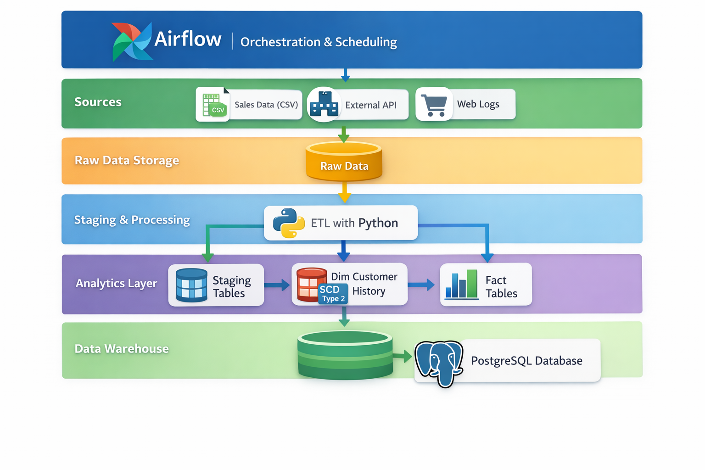

# Sales Analytics Data Platform

## Business Problem
This project implements an end-to-end **batch data pipeline** for retail analytics.

The goal is to ingest transactional sales data, transform it into analytics-ready tables, and support **historical analysis** of customer and product performance.

The platform is designed to reflect real-world data engineering patterns, including raw data ingestion, staged transformations, dimensional modeling, and historical tracking of changes.

---

## Data Pipeline Flow
Source → Raw → Staging → Analytics
## Architecture



### Source
- CSV files representing retail entities:
  - customers
  - customer updates
  - products
  - stores
  - sales transactions

### Raw
- Data stored **as-is**
- No transformations applied
- Preserves source fidelity for auditing and reprocessing

### Staging
- Data cleaned and typed
- Business keys validated
- Prepared for analytical modeling

### Analytics
- Modeled into a **star schema**
- Optimized for analytical queries

---

## Data Model

### Fact Table
**fact_sales**
- sale_id  
- customer_id  
- product_id  
- store_id  
- sale_timestamp  
- quantity  
- revenue  

### Dimension Tables
- **dim_customer** (Slowly Changing Dimension Type 2)
- dim_product
- dim_store
- dim_date

---

## Slowly Changing Dimension (SCD Type 2)

Customer attributes such as email and loyalty tier can change over time.

To preserve historical accuracy, the `dim_customer` table implements **SCD Type 2** using:
- customer_id (business key)
- effective_start_date
- effective_end_date
- is_current

When a customer attribute changes, a new row is created while the previous version is expired.  
This allows accurate historical reporting without overwriting past data.

---

## Repository Structure

Sales-Analytics-Data-Platform/
├── data/
│ └── raw/
├── scripts/
│ └── generate_data.py
├── sales_analytics/
│ ├── ingest/
│ ├── transform/
│ └── load/
├── sql/
│ └── dim_customer_scd.sql
├── airflow/
│ └── dags/
│ └── sales_analytics_pipeline_dag.py
├── README.md
├── requirements.txt
└── .env.example


---

## Processing Mode
This pipeline operates in **batch mode**, processing snapshot-based retail data on a scheduled run.

The design prioritizes **correctness, rerunnability, and historical accuracy** over low-latency processing.

---

## Database Persistence
Analytics tables are materialized into a **PostgreSQL** database using SQLAlchemy.

Only analytics-layer tables are persisted; raw and staging layers remain transient to ensure modularity and rerunnability.

---

## Orchestration
A stub **Apache Airflow DAG** is included to demonstrate how the batch pipeline would be orchestrated in a production environment.

The DAG triggers the existing Python-based pipeline without duplicating transformation logic, reinforcing Airflow’s role as an orchestrator rather than a processing engine.

---
## Testing and Observability
The pipeline includes lightweight unit tests for critical transformation logic (SCD Type 2) and structured logging to support observability, debugging, and rerunnable batch execution.

## How to Run

### 1. Create and activate a virtual environment
```bash
python -m venv .venv
source .venv/Scripts/activate
```

### 2. Install dependencies
```bash
   pip install -r requirements.txt
```
### 3. Generate synthetic source data
```bash
   python scripts/generate_data.py
```
CSV files will be created in data/raw/.

## Notes

The dataset is synthetic by design to allow controlled simulation of customer changes for SCD Type 2.

The focus of this project is data engineering architecture and transformation logic, not visualization.

## Skills Demonstrated

- Python-based data ingestion and transformation
- SQL-based analytical modeling
- Dimensional modeling (fact and dimension tables)
- Slowly Changing Dimensions (Type 2)
- Batch pipeline design
- Database persistence (PostgreSQL)
- Orchestration awareness (Airflow)
- Project structuring and documentation
